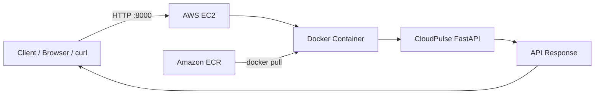

# ☁️ CloudPulse

### Containerized FastAPI Microservice Deployed on AWS

CloudPulse is a **FastAPI-based microservice** packaged using **Docker**, stored in **Amazon ECR**, and deployed on an **Amazon EC2** instance.

### Deployment Flow

```text
FastAPI → Docker → Amazon ECR → EC2 → Docker Container → API
```

---

##  Features

* FastAPI REST API
* Docker containerization
* Amazon ECR image storage
* AWS EC2 deployment
* IAM-based ECR access
* Security Group configuration
* API health and information endpoints

---

##  Technologies Used

| Technology     | Purpose                 |
| -------------- | ----------------------- |
| Python         | Application development |
| FastAPI        | Web/API framework       |
| Docker         | Containerization        |
| Amazon ECR     | Docker image registry   |
| Amazon EC2     | Cloud server            |
| AWS IAM        | Access management       |
| Security Group | Network firewall        |
| AWS CLI        | AWS operations          |
| curl           | API testing             |

---

## 🏗️ Architecture



---

##  Project Structure

```text
CloudPulse/
│
├── Dockerfile
├── requirements.txt
├── app/
│   └── main.py
│
└── README.md
```

> Update the structure according to your actual project files.

---

# Prerequisites

* Python
* Docker
* AWS Account
* AWS CLI
* Amazon ECR repository
* Amazon EC2 instance
* IAM role with ECR permissions

---

#  Run Locally

### Install Dependencies

```bash
pip install -r requirements.txt
```

### Run FastAPI

```bash
uvicorn app.main:app --host 0.0.0.0 --port 8000
```

Open:

```text
http://localhost:8000
```

---

#  Docker

### Build Image

```bash
docker build -t cloudpulse:latest .
```

### Run Container

```bash
docker run -d --name cloudpulse-container -p 8000:8000 cloudpulse:latest
```

### Check Container

```bash
docker ps
```

### View Logs

```bash
docker logs cloudpulse-container
```

---

# ☁️ Amazon ECR

**Region:** `eu-north-1`
**Repository:** `idhishri_cp`
**Type:** Private
**Image:** `cloudpulse:latest`

### Login to ECR

```bash
aws ecr get-login-password --region eu-north-1 | docker login --username AWS --password-stdin ACCOUNT_ID.dkr.ecr.eu-north-1.amazonaws.com
```

### Tag Image

```bash
docker tag cloudpulse:latest ACCOUNT_ID.dkr.ecr.eu-north-1.amazonaws.com/idhishri_cp:latest
```

### Push Image

```bash
docker push ACCOUNT_ID.dkr.ecr.eu-north-1.amazonaws.com/idhishri_cp:latest
```

---

# AWS EC2 Deployment

The application is deployed on an **Amazon Linux 2023 EC2 instance**.

| Configuration    | Value               |
| ---------------- | ------------------- |
| Instance Type    | `t3.micro`          |
| Region           | `eu-north-1`        |
| OS               | Amazon Linux 2023   |
| Application Port | `8000`              |
| IAM Role         | `CloudPulseEC2Role` |

### Install Docker

```bash
sudo dnf update -y
sudo dnf install -y docker
sudo systemctl start docker
sudo systemctl enable docker
sudo usermod -aG docker ec2-user
```

Verify:

```bash
docker --version
```

---

#  IAM Configuration

The EC2 instance uses:

```text
CloudPulseEC2Role
```

with:

```text
AmazonEC2ContainerRegistryReadOnly
```

This allows EC2 to securely pull the Docker image from the private ECR repository without storing AWS access keys on the server.

---

#  Security Group

| Protocol | Port | Purpose                  |
| -------- | ---: | ------------------------ |
| TCP      |   22 | SSH / EC2 administration |
| TCP      | 8000 | CloudPulse API           |

For production use, network access should be restricted and HTTPS should be configured.

---

#  Pull & Run on EC2

### Login to ECR

```bash
aws ecr get-login-password --region eu-north-1 | docker login --username AWS --password-stdin ACCOUNT_ID.dkr.ecr.eu-north-1.amazonaws.com
```

### Pull Image

```bash
docker pull ACCOUNT_ID.dkr.ecr.eu-north-1.amazonaws.com/idhishri_cp:latest
```

### Run Container

```bash
docker run -d --name cloudpulse-container -p 8000:8000 ACCOUNT_ID.dkr.ecr.eu-north-1.amazonaws.com/idhishri_cp:latest
```

### Verify

```bash
docker ps
docker logs cloudpulse-container
```

---

# 🔗 API Endpoints

| Endpoint  | Purpose                 |
| --------- | ----------------------- |
| `/`       | Basic service response  |
| `/health` | Health check            |
| `/info`   | Application information |
| `/stats`  | Application statistics  |

### Test API

```bash
curl http://EC2_PUBLIC_IP:8000/
curl http://EC2_PUBLIC_IP:8000/health
curl http://EC2_PUBLIC_IP:8000/info
curl http://EC2_PUBLIC_IP:8000/stats
```

The project uses port `8000` for the FastAPI service.

---

Complete Deployment Flow

```text
1. Develop FastAPI Application
          ↓
2. Build Docker Image
          ↓
3. Test Locally
          ↓
4. Push Image to Amazon ECR
          ↓
5. Launch EC2 Instance
          ↓
6. Install Docker
          ↓
7. Configure IAM Role
          ↓
8. Pull Image from ECR
          ↓
9. Run Docker Container
          ↓
10. Test API
```

---

 Security

* Never commit AWS credentials or private keys.
* Keep the ECR repository private.
* Use IAM roles instead of hard-coded credentials.
* Restrict SSH access.
* Expose only required ports.
* Use HTTPS/TLS for production.

---
 Future Improvements

* HTTPS/TLS with a domain
* GitHub Actions CI/CD
* AWS CloudWatch monitoring
* Automated testing
* Versioned Docker images
* Authentication and authorization
* ECS/Fargate deployment
* Load balancer/reverse proxy

---
Author

**Itishree Acharya**
B.Tech CSE
Dronacharya College of Engineering, Gurugram

---
Project Summary

**CloudPulse is a containerized FastAPI microservice deployed on AWS using Docker, Amazon ECR, and Amazon EC2.**
